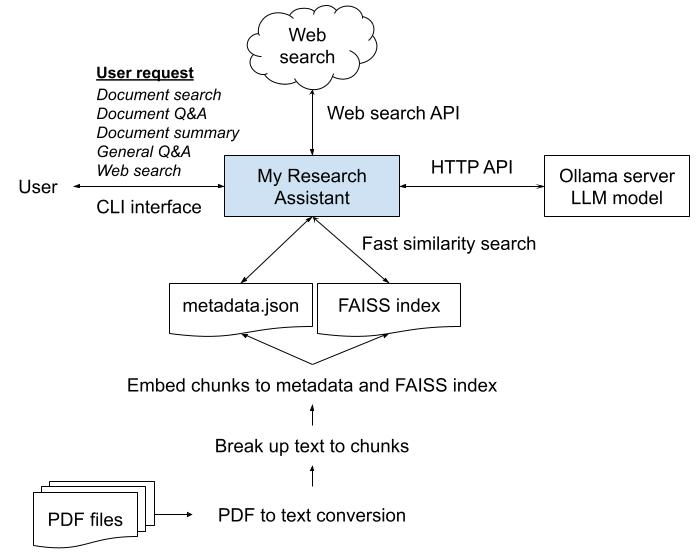
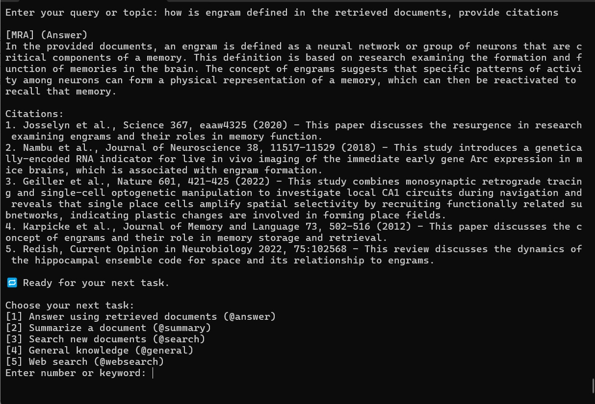

# My Research Assistant (MRA)

Version 2: November 10, 2025

**My Research Assistant (MRA)** is a private document search and Q&A system using a local LLM. MRA runs entirely on a local machine: no cloud, no cost, no Internet required. This solves my problem of accessing and activating over 1,000 documents sitting idle in my computers at home. With MRA, I'm now re-discovering ideas hidden in those old articles. As of Version 2, MRA is a CLI (command line interface) application, running on Linux OS.

## Features

- Conversational interface for querying local documents and previous sessions
- No cost and private interaction with local LLM via Ollama HTTP API
- Markdown logging for session history and post-session query
- Semantic document search using FAISS and Sentence Transformers
- Integrated Web search via Brave Search API for latest information search 
- Modular utilities for PDF conversion, chunking, embedding, and index updates
- CLI-based task-selections for document search, Q&A, summary, general inquiry and web search

## How it works

## Project Structure

<pre>
MyResearchAssistant/
├── main.py                      # Entry point
├── config.py                    # Paths, model settings, token limits, API keys
├── conversation.py              # Interactive loop
├── markdown_logger.py           # Markdown session logs
├── llm_interface.py             # Local LLM via Ollama API
├── prompt_builder.py            # Prompt assembly
├── retrieval.py                 # FAISS + metadata retrieval
├── utils.py                     # Token counting, history
├── web_search.py                # Global web search
├── faiss_index                  # Semantic index (must be built by util tools)
├── chunk_metadata_updated.json  # Metadata for index (must be built by util tools)
├── README.md                    # readme info
├── LICENSE                      # MIT license
├── requirements.txt             # required libraries
├── logs/                        # folder for logs (MRAlog_*timestamp*.md)
├── util/                             # folder for index and metadata util tools
├── util/pdfs_in/                     # folder Source PDFs
├── util/pdfs_md/                     # folder Markdown-converted PDFs
├── util/pdfs_ocr/                    # folder for OCR-needed PDFs
├── util/MRA_1pdf2text.py             # Converts PDF to text/markdown
├── util/MRA_2chunk_md.py             # Chunks markdown files
├── util/MRA_3embed_chunks_B.py       # Batch embedding
├── util/MRA_3embed_chunks_S.py       # Streaming embedding
├── util/MRA_4migrate_chunk_metadata.py    # Converts old chunk format
├── util/MRA_6addchunk_md_enhanced.py # Chunks new files in logs folder
├── util/MRA_7update_index_batch.py   # Updates index
├── util/chunk_md.jsonl               # Output from chunking for embedding
├── util/addchunk_md.jsonl            # Output from index updates
└── util/log_chunk_md.txt             # Chunking log
</pre>

## Requirements

<pre>
numpy==1.26.0
torch==2.5.1
transformers==4.25.1
sentence-transformers==2.2.2
huggingface-hub==0.10.1
faiss-cpu==1.7.4
faiss-gpu==1.7.2
tiktoken==0.12.0
tqdm==4.67.1
requests==2.32.5
beautifulsoup4==4.14.2
trafilatura==2.0.0
fitz===0.0.1.dev2
</pre>

**Assumption:**
- GPU: RTX 4070 12GB vRAM equivalent or above
- ollama and an open weight model (e.g. mistral 7B) are installed and running.
- For PDF to text conversion, install ocrmypdf, PyMuPDF, PyMuPDF4LLM, pymupdf-layout, tesseract-ocr, pngquant, ghostscript

## Setup

Virtual environment is strongly recommended when installing Python packages.
<pre>
python -m venv .venv
source ./.venv/bin/activate
</pre>

### 1. Install dependencies

<pre>pip install -r requirements.txt</pre>

### 2. Install Ollama and pull your local model

<pre>
url -fsSL https://ollama.com/install.sh | sh
ollama serve
ollama pull mistral
ollama run mistral
</pre>

### 3. Prepare your PDFs

To prepare faiss index and metadata, separate preparation steps are necessary.
See util/Requirements4MRAutilities.txt for details.
Once all reqs are complete, you can take the following steps:
- Place original PDFs in `pdfs_in/`
- Run `MRA_1pdf2text.py` to convert them to markdown, outputs in 'pdfs_md' folder
- Run `MRA_2chunk_md.py` to chunk md files and generates chunks_md.jsonl
- Run `MRA_3embed_chunks_B.py` to generate FAISS_index and chunk_metadata.json
- Use `MRA_6addchunk_md_enhanced.py` to chunk new files in /logs folder
- Use `MRA_7update_index_batch.py` to update the FAISS index and metadata

## Usage

Launch the assistant:

<pre>python main.py</pre>

**Example session:**

<pre>
🧠 Welcome to My Research Assistant (MRA)
💬 Type 'exit' to quit at any time.

Choose your next task:
[1] General knowledge (@general)
[2] Search documents (@search)
[3] Web Search (@globalsearch)
Enter number or keyword: 1
Enter your query or topic: hello

[MRA] (General)
Hello! How can I assist you today? If you have a specific research topic in mind, feel free to ask and I'll do my best to help.

🔁 Ready for your next task.

Choose your next task:
[1] General knowledge (@general)
[2] Search documents (@search)
[3] Web Search (@globalsearch)
Enter number or keyword: 2
Enter your query or topic: are there examples of engram being implemented in robots?

Top documents:
[1] ...
[2] ...
.
.
[20] ...

🔁 Ready for your next task.

Choose your next task:
[1] Answer using retrieved documents (@answer)
[2] Summarize a document (@summary)
[3] Search new documents (@search)
[4] General knowledge (@general)
[5] Web Search (@globalsearch)
Enter number or keyword:
</pre>

## Notes

- All processing is local (except web search). No cloud-based LLM dependencies.
- Markdown logs are saved in `logs/` with timestamped filenames.
- Use utility tools to update index for new files and logs, then you can query on previous sessions.
- You can switch between batch and streaming embedding modes.

